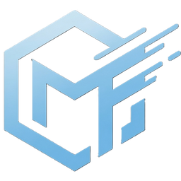

  

# 🪐 DRS Motion Forge Studio

**DRS Motion Forge Studio** is a next-generation, GPU-accelerated video editing and motion graphics compositing suite. It bridges the gap between timeline-based sequencing (like Adobe Premiere Pro) and node-based visual effects (like After Effects) in a unified, dockable glassmorphic workspace. Designed from the ground up for modern creator workflows, Motion Forge Studio offers an ethical, subscription-free alternative to industry standards.

---

## ✨ Features & Capabilities

### 🖥️ DirectX 12 Compositing Engine
*   **Hardware Acceleration:** Real-time post-processing utilizing highly optimized D3D12 compute shaders.
*   **Zero-Copy Screen Capture:** High-performance capture pipeline using Windows.Graphics.Capture (WGC) for recording your screen without lag.
*   **GPU-Driven Filters:** Color Grading, Box Blurs, Chroma Keying, CRT Emulation, Bloom/Glow, and advanced vector transformations.

### 🎥 Native Hardware Video Engine
*   Zero-dependency video stream decoding powered by **Windows Media Foundation (WMF)**.
*   Supports native Windows file container formats (`.mp4`, `.mov`, `.avi`, `.wmv`) with asynchronous background transcoding.
*   D3D12 hardware-accelerated H.264/HEVC encoding for blazing-fast exports.

### 🎙️ Advanced Audio & Input Hooking
*   **WASAPI Loopback Capture:** Record process-isolated audio streams directly from target applications (e.g., Discord, games) and microphones on separate tracks.
*   **Dynamic Audio Ducking:** Automatic sidechain compressor built-in to lower background music when voice input is detected.
*   **Vector Metadata Tracking:** Captures screen-space mouse movements and keystrokes via low-level Win32 hooks to render them as editable vector overlays rather than burned-in pixels.

### 🕸️ Visual Compositor Node Graph
*   Blueprint-style visual compositing graph for absolute control.
*   Interactive canvas to link visual effects, color grade, and manipulate video textures before final rendering.
*   **Parametric Linking:** Easily connect variables (e.g., Audio Amplitude to a shape's Scale) without writing manual expression code.

### 📈 Motion Graphics & Template Engine
*   **Physical Spring Interpolation:** Generate natural wobble and bounce animations using physical spring physics (Tension, Dampening, Mass) instead of tedious Bezier handles.
*   **Unified Start Hub:** A modern welcome screen to launch templates, manage recent projects, and check GPU diagnostics.
*   **Preset Library:** Browse, deconstruct, and modify `.mfpreset` templates directly in the app, or create your own graphics from scratch.

---

## 🚀 Getting Started

1. Go to the **[Releases](#)** page on this repository.
2. Download the latest compiled binary package (e.g., `DRSMotionForgeStudio-vX.X.X.zip`).
3. Extract the contents to your desired location on your Windows machine.
4. Run `DRSMotionForgeStudio.exe` to launch the application.

*(Note: Windows 10 or 11 is required.)*

---

## 🎮 Basic Controls

*   **Timeline Scrubbing**: Click and drag on the horizontal **Time Ruler** at the top of the timeline panel, or click and drag the **Red Playhead Line** inside the track lanes.
*   **Play/Pause**: Press `Spacebar` (when keyboard is not captured by text input fields).
*   **Tool Selection**: Use keyboard shortcuts: **Selection (V)**, **Track Select Forward (A)**, **Ripple Edit (B)**, **Razor (C)**, **Slip (Y)**, and **Hand (H)**.
*   **Compositing Links**: Drag a link connection line from any **RGBA Out** pin (green circle) and drop it onto an **Image In** pin (blue circle) on another node.
*   **Add Graph Nodes**: Right-click anywhere on the empty dark grid of the Compositor Canvas to open the creation popup menu.

---

## 💸 Business Model & Licensing Strategy

Motion Forge Studio is committed to offering a creator-friendly, ethical alternative to predatory subscription software. We utilize an **Honor-System, Revenue-Tiered Licensing Model**—ensuring the software remains free for beginners and students, while receiving fair compensation from professionals making a living with the tool.

*   **Motion Forge Personal (100% Free)**:
    *   *For*: Hobbyists, students, and creators earning less than **$20,000/year** utilizing the software. Includes full access to the editing engine, capture tools, and template browser.
*   **Motion Forge Professional ($49 One-Time, Own Forever)**:
    *   *For*: Freelancers, independent editors, and YouTubers earning between **$20,000 and $100,000/year** utilizing the software.
*   **Motion Forge Enterprise ($199 One-Time, Own Forever)**:
    *   *For*: Creative agencies, corporations, and studios earning over **$100,000/year**.

### 🎖️ Military & Veteran Benefits
As a Veteran-owned company, DevRight Studios is incredibly proud to support our military members. All verified Active Duty service members and Military Veterans receive a **50% discount** on any license purchase *and* receive **Free Lifetime Updates** (bypassing the standard major version upgrade fees) upon verification with ID.me at checkout.

*No monthly subscriptions, no cancellation fees, and no cloud-lockouts. Pay once, own your tools forever.*

---

## 📜 License

This software and its source code are proprietary and belong to DevRight Studios. It is licensed under the **DRS Motion Forge Studio End User License Agreement (EULA)** - see the `LICENSE` file included with your download for the full legal details of our revenue-tiered licensing model.
